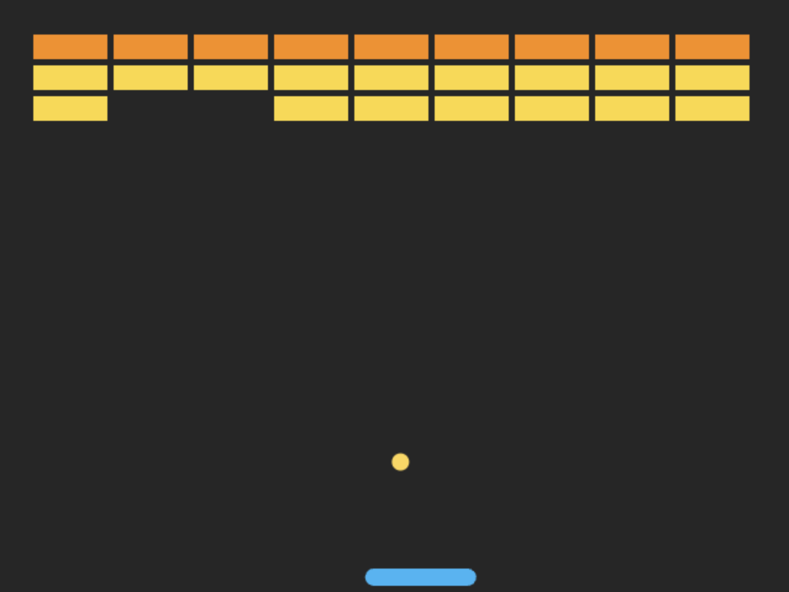

# Brick Breaker Game

A classic brick-breaker game built in vanilla JavaScript and HTML Canvas. Use the paddle to bounce the ball and destroy all the bricks! As the game progresses, the ball speeds up and more bricks are added to increase the challenge.

## Features

- Smooth paddle and ball movement
- Frame-independent speed handling
- Particle explosion effects when bricks are destroyed
- Increasing difficulty over time (brick rows & ball speed)

## Screenshots

## 🧩 Controls

- ⬅️ Left Arrow – Move paddle left
- ➡️ Right Arrow – Move paddle right

## 🛠 Tech Stack

- HTML5 Canvas
- JavaScript (ES6 modules)
- Tailwind CSS for simple styling
